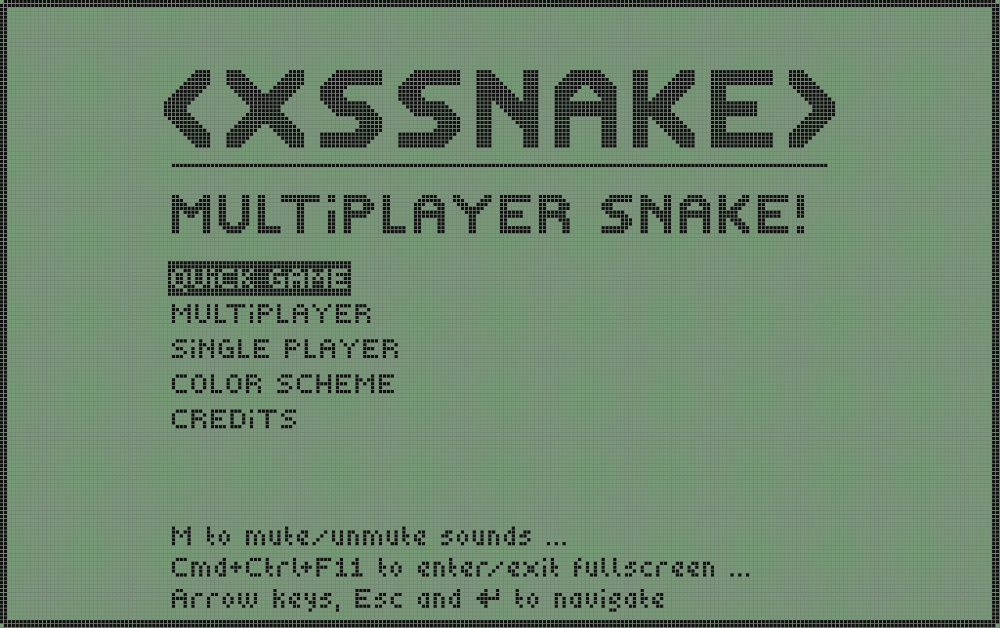

# XSSnake

<a href="https://github.com/blaise-io/xssnake/actions/workflows/test.yml">

</a>

Online multiplayer Snake where the winner of a game is allowed to execute
JavaScript in the browser of other players.

XSSnake is currently in development. The beta release is planned mid 2050.



I will run a public server when this project is stable. If you can't wait:

```sh
# 8001: game server
# 8002: static http server which serves the client game files
docker run --rm -p 8001:8001 -p 8002:8002 -it blaiseio/xssnake
open http://127.0.0.1:8002  # in a web browser
```
